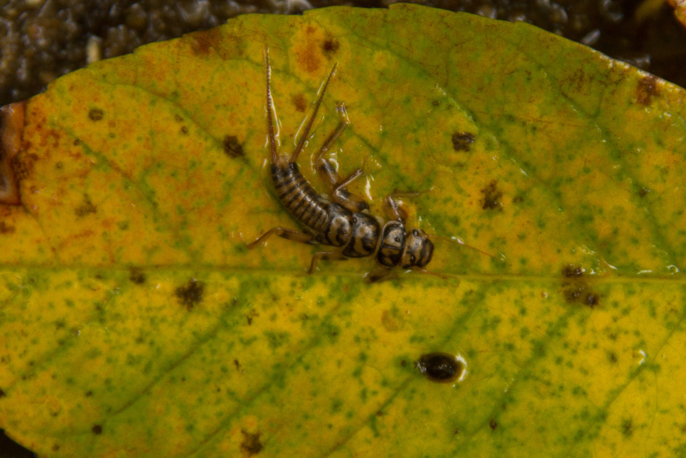
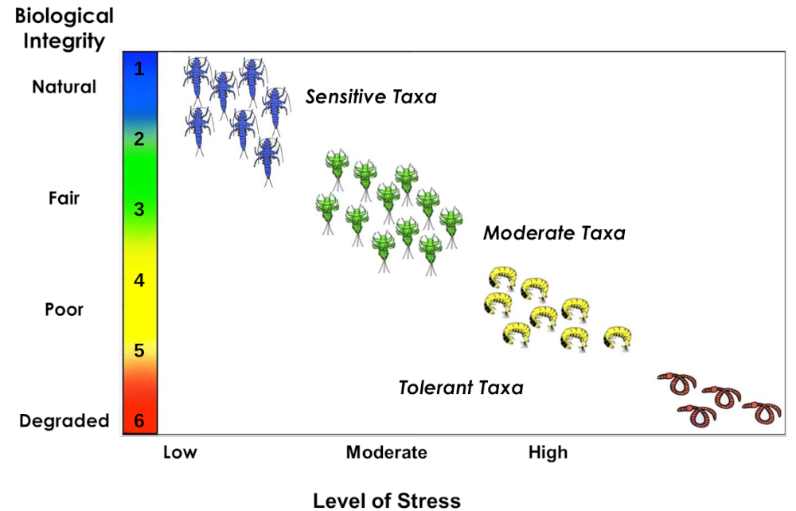

# 30 + Years of Bioassessment in Connecticut using Macroinvertebrates (1989 - 2020)

## Map

 https://marybecker.github.io/bioassessment/

## Abstract

The goal of the clean water act is to restore and maintain the chemical, physical, 
and biological integrity of the Nation's waters.  Biological integrity is the ability of an aquatic ecosystem 
to support and maintain a balanced, adaptive community of organisms having a species composition, diversity, 
and functional organization comparable to that of natural habitats within a region. The presence, condition, 
numbers and types of fish, insects, algae, plants, and other organisms provide direct, accurate information 
about the health of water bodies. Biological assessments measure these factors and are the primary tool used 
to evaluate the condition of water bodies. Because biological communities are affected by all of the stressors 
to which they are exposed over time, bioassessments provide information on disturbances not always revealed by 
water chemistry or other measurements.



*Perlidae (Common Name: Stonefly).  Photo courtesy Peter Zaidel*

Bioassessments have formed the foundation of many water quality monitoring programs throughout 
the United States. Like many state water quality programs, the Connecticut Department of Energy and Environmental 
Protection (CT DEEP) has collected and organized data on
species richness, species composition, relative abundance, and feeding relationships among macro-invertebrates 
present in stream and river systems. Benthic macroinvertebrates 
are animals without backbones, who inhabit the bottom of rivers and streams, as well as many other waterbody types. 
These organisms are very well studied and have a long history of use as indicators of water quality. 
Certain types, including mayflies, stoneflies, and caddisflies, can survive only in the cleanest water quality 
conditions. Other major groups of macro-invertebrates are true flies, beetles, worms, crustaceans, and dragonflies. 
Tolerant species are those that can live in highly polluted waters, moderate species can endure a moderate 
level of pollution, while sensitive species only occur in waters with little to no pollution. 
Macro-invertebrate community data are summarized into metrics that describe the biological condition of the stream.



*Example of macroinvertebrate taxa along the biological condition gradient*

The map explores macroinvertbrate samples collected in Connecticut over the last 31 years.  Biological condition gradient (BCG)
metrics derived from the macroinvertebrate community samples are shown in different colors on the map.  BCG tiers range from
2 indicating low stress in the stream and excellent water quation to 6 indicating high stress in the stream and poor water quality.

Available data was collected by the CT DEEP Monitoring and Assessment program over the past 30 years (1989 – 2020) 
using a consistent sampling method (kick-net 2 m2). Metrics were derived using macroinvertebrate biological condition
gradient categories described in Gerritsen and Jessup (2007). 

## Data

[Biological Condition Gradient Metrics Macro-invertebrate data collected by the CT DEEP Monitoring and Assessment Program.](https://github.com/marybecker/bioassessment/blob/main/data/Bug_BCG_121721.csv)

## Data Processing

```command
$ csv2geojson --lat 'YLAT' --lon 'XLONG' --numeric-fields BCG,YCNT Bug_BCG_121721.csv > BugBCG.geojson

$ ogrinfo -so BugBCG.geojson BugBCG

INFO: Open of `BugBCG.geojson'
      using driver `GeoJSON' successful.

Layer name: BugBCG
Geometry: Point
Feature Count: 1419
Extent: (-73.683200, 41.022000) - (-71.802000, 42.049500)
Layer SRS WKT:
GEOGCS["WGS 84",
    DATUM["WGS_1984",
        SPHEROID["WGS 84",6378137,298.257223563,
            AUTHORITY["EPSG","7030"]],
        AUTHORITY["EPSG","6326"]],
    PRIMEM["Greenwich",0,
        AUTHORITY["EPSG","8901"]],
    UNIT["degree",0.0174532925199433,
        AUTHORITY["EPSG","9122"]],
    AUTHORITY["EPSG","4326"]]
STA_SEQ: String (0.0)
SDATE: Date (0.0)
SYEAR: String (0.0)
BCG: String (0.0)
MEM: String (0.0)

```
## References

Connecticut Department of Energy and Environmental Protection Monitoring and Assessment Program.  1989 - 2020. Macroinvertebrate Community Data Collected in High Gradient Rivers and Streams of Connecticut. 

Davies S.P., Jackson S.K. 2006. The biological condition gradient: a descriptive model for interpreting change in aquatic ecosystems. EcologicalApplications 16:1251–1266.

Gerritsen J, Jessup B. 2007. Calibration of the biological condition gradient for high gradient streams of Connecticut. Report prepared for US EPA Office of Science and Technology and the Connecticut Department of Environmental Protection. TetraTech, Maryland.

## Mapbox References

Tutorial - https://docs.mapbox.com/help/tutorials/show-changes-over-time/

Expressions - https://docs.mapbox.com/mapbox-gl-js/style-spec/expressions/

Style Circles - https://docs.mapbox.com/mapbox-gl-js/example/data-driven-circle-colors/

Add Raster Source - https://docs.mapbox.com/mapbox-gl-js/example/map-tiles/

Display a popup - https://docs.mapbox.com/mapbox-gl-js/example/popup/

Time Slider - https://docs.mapbox.com/mapbox-gl-js/example/timeline-animation/


## Acknowledgements
Thanks to Rich Donohue at [New Maps Plus UKY](https://newmapsplus.as.uky.edu/) for code examples and suggestions that greatly improved this map.  
Thanks to the Monitoring and Assessment and GIS staff at CT DEEP for their dedicated efforts to collect, organize and manage and high-quality data.